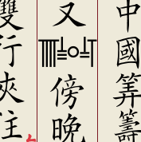

# 數碼字型及其簡單排版之例

傳統數字有筭籌、花碼、數字卦。這些數碼古時常用，迩者竟被忽視，缺乏堪用之字型，迄今曾不能排店肆賬簿、市井價牌，古筭書之電子化更无從談起。

本庫提供一款**可變字型**，包含筭籌、花碼、數字卦，並闡述其基本用法。欲觀排書之效果，請移步[哂蟹齋](https://vert.neocities.org/)。

## 筭籌

筭數行籌，尚矣。其式橫行以便布筭，縱橫交替，「一縱十橫百立千僵」是也。本字型不要求用戶在輸入時攷慮交替規則，亦不需輸入擴展平面之筭籌，而逕輸入花碼即可。



層疊樣式表：
``` CSS
font-feature-settings: "ss01"/* 縱起 */"ss02"/* 橫起 */;
font-variant-ligatures: contextual; font-kerning: normal;
```
闍婆腳本：
``` JavaScript
// …先據縱式數值求得伸縮係數…
筭籌容器.style.fontStretch = String(伸縮係數)+"%";
```

註：〥之籌碼，用後起之「五加〇」式，即：縱式爲一橫下加一〇，橫式爲一縱下加一〇。欲用傳統五畫（𝍤、𝍭）者，請施樣式`font-variation-settings: "hist" 1`或`font-variant-alternates: historical-forms`。

## 花碼（蘇州碼子）

花碼即籌之寫體。非末位而末畫爲橫者，即二、三、〦、〧、〨，末橫變作提。

層疊樣式表：
``` CSS
font-variant-ligatures: contextual; font-variation-settings: "cswh"
```
闍婆腳本：
``` JavaScript
// …先據縱式數值求得伸縮係數…
筭籌容器.style.fontStretch = String(伸縮係數)+"%";
```

## 數字卦

數字卦縱行，順乎文字，而異于籌系。

---
## 遠期計畫

- 支持數位標等，即科學記數法。允許標中文數等字，十、百、千、萬（万）而迄正、載，詳見[萬年夏曆](https://vert.neocities.org/cld/%E8%90%AC%E5%B9%B4%E5%A4%8F%E6%9B%86/)之《附錄·數等》。例如：輸入`〥〧萬〣〦`，顯示：
```
〥〧〣〦
　萬
```
- 字型變量增設粗細軸和光學軸。粗細軸`wght`控制筆畫之粗細．而光學軸`opsz`則控制筭籌〥至〩之頂畫長短，及花碼之連筆大小。
- （私貨）增補十六進制筭籌。
